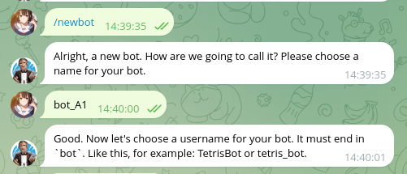
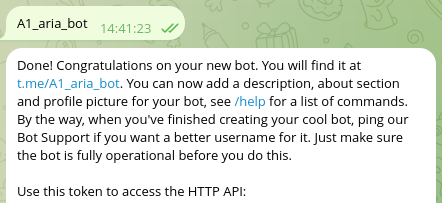

# cara setup token
- buat bot baru di tele @fatherbot

  
  
- buat file .env dan masukan token bot api telegram
  ```py
  export BOT_TOKEN=<token>
  ```

# cara setup linux
```bash
git clone https://github.com/ariafatah0711/bot-animal-search
cd bot-animal-search
chmod +x run.sh

# install
./run.sh install

# running the bot
source venv/bin/activate
python3 bot.py

# remove
./run.sh remove
```